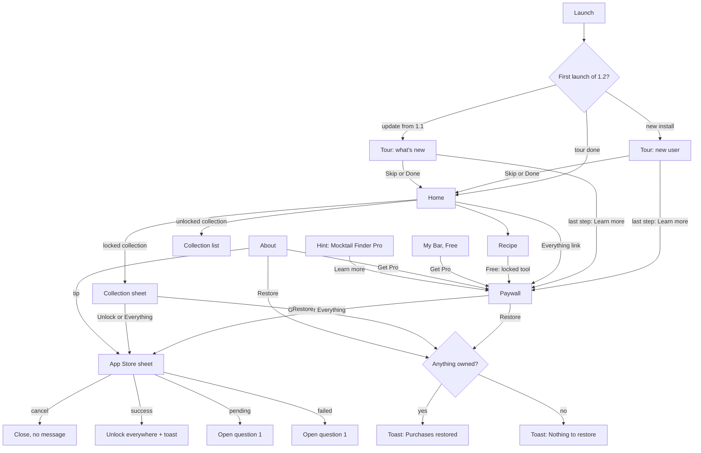

# Handoff: Mocktail Finder 1.2 "Pro"

## Overview
Mocktail Finder is live on the App Store (1.1: Expo / React Native, TypeScript; catalogue drinks from TheCocktailDB, favourites, own recipes with photos, light / dark / system theme, English and Ukrainian). Version 1.2 adds:
- **Pro** (one purchase): My Bar ("what can I make with what I have"), shopping list, servings 1–12, recipe cards shared as a photo.
- **Six paid collections**, 10 tested 0.0% drinks each, and **Everything** (Pro + every collection, now and later).
- **Tip jar** "Drinks for the developer": consumable, unlocks nothing.
- **Onboarding tour** and **hints during use**.
- **Settings rework**: the theme moves from the header to About.

Everything free in 1.1 stays free. Purchases: Apple In-App Purchase, StoreKit 2. No accounts, no analytics, no data collected.

## About the design files
The HTML prototype is a design reference: it shows the intended look and behaviour; it is not production code. Recreate it in the existing codebase with its own patterns and libraries. System UI is only mocked in the prototype and must be native in the app: the App Store purchase sheet, the share sheet, the photo action sheet and the delete alert.

## Fidelity
High fidelity. Colours, typography, spacing, copy and states are final.

## Sources of truth (in this order)
1. This README, `COPY_EN_UK.md` (every string) and `data/recipes.json` (all 118 drinks).
2. `prototype/mocktail-finder-1.2-prototype.html`: open in Chrome or Safari, works offline. The debug panel (top right) switches theme, language, Pro, a collection, Everything and store availability; "New session" re-arms the hints, "Replay onboarding" restarts the tour.
3. Figma, page `mocktail-finder`: https://www.figma.com/design/7bjtNXU1MkYhV4VidPG5uk/?node-id=375-770. It is being updated in parallel. Where it differs from the prototype, **the prototype wins** (table below).
4. `reference/mf-data.js`: the prototype's data and logic (amount scaling, ingredient keys, plurals, both dictionaries). A reference for behaviour, not code to copy.

Never invent copy. A missing string goes to "Open questions" in `PROGRESS.md`.

## Prototype wins over Figma
| # | Area | Figma now | Build this |
|---|---|---|---|
| 1 | Third tab | "Kitchen", bag icon | "My Bar" / «Мій бар», glass icon; header subtitle "Mix with what you have" |
| 2 | Home order | Search → Category → Collections → Ingredients | Search → Collections → Category → Filter by Ingredients → Featured Recipes. The Collections row hides while a search, category or ingredient filter is active |
| 3 | Home chips | wrapping rows | one horizontally scrolling row each |
| 4 | Header | theme button + "…" | only "…" (opens About). The glass foot sits on the wordmark baseline; the bubbles rise in a 3.4 s loop, static with Reduce Motion |
| 5 | Theme | header toggle | About → Theme row → sheet: System / Light / Dark |
| 6 | Collections | 3 packs | 6 collections × 10 drinks from `recipes.json`, €2.99 each |
| 7 | My Bar, Pro | every chip group on the screen | "Your bar" summary card + "Add ingredients" sheet (search, Most used, 9 groups with icons, "Show N drinks") |
| 8 | Onboarding | none | tour over the real UI + hints during use |
| 9 | Tip jar | "Buy me a mocktail", highlighted middle card, "Most popular" | "Drinks for the developer" on a mint panel, three identical cards, animated icons, "Thanks!" pill; the TheCocktailDB credits line is removed |
| 10 | Ice lines | "120 g; serving — 60 g  Ice: mixing" | "Ice — 120 g for stirring + 60 g for serving"; "Ice — 0 g" lines removed |
| 11 | Recipe, 1.2 | two Pro buttons | the free "Share Recipe" stays; the Pro buttons go below it |

This table is also the Figma update list.

## Screens
**Home.** Gradient header: logo, wordmark, "…" button. Search 48 high, radius 12. Collections: horizontal pack cards 160 wide (cover 160 × 130, radius 16; a pill with lock + price, or "Unlocked"); "Everything · €12.99" link right of the title, hidden when owned or when the store is unreachable. Category chips and Filter by Ingredients chips (pills, 36 high). "Featured Recipes" with a "Surprise recipe" pill. Recipe cards: photo 180 high, radius 16, heart button 36. Tapping an unlocked collection filters the list: title "<collection> · 10 drinks", "All recipes" link back.

**Recipe (pushed).** Photo 300 high under the status bar; round back and heart buttons (36). Title card: Title L, tag badges, description. Ingredients card: Servings row with a stepper 1–12, then the ingredient rows. Steps card with numbered brand circles. Buttons 48 high, radius 12: Add to Favourites ↔ Saved to Favourites (outline, filled heart), Share Recipe, Add to shopping list (Pro), Share as card (Pro). Free: the Servings row and the two Pro buttons at 50 % opacity with a small lock; any tap on them opens the paywall. Own recipe: Edit / Delete (alert "Delete this recipe?").

**Share card.** 1080 × 1350 PNG: photo 1080 × 820, title Sora Bold 76/90, tags in the brand colour (collection drinks add "· 0.0%"), one ingredient line (2 lines max), footer: logo + "Mocktail Finder · apps.apple.com/app/id6811610325". Preview → Share → native share sheet.

**Surprise, Favourites, Add Recipe.** As in 1.1.

**My Bar.** Segmented control "What I have | Shopping list".
- Free: a locked card (lock in a circle, title, text, "Get Pro · €5.99") and the line "Pro also adds…"; each segment has its own title and text.
- Pro, What I have: "Your bar" card with the count, ticked items as removable chips (first 8, then "+N"), the empty text, "Add ingredients" and "Clear", and the note "Ice, water, sugar and salt are always in." Below: "You can make now (N)" cards and "Missing one ingredient (M)" cards with "Missing: <ingredient>" in the error colour.
- Add ingredients sheet: search "Find an ingredient…", "Most used" (top 10 by number of drinks), then 9 collapsible groups with an icon and "a of b ticked"; ticked tiles get a brand border and mint fill; "Nothing found."; bottom button "Show N drinks" ("Done" when N = 0).

**Shopping list (Pro).** "N items · M ticked" + "Clear ticked". Rows: checkbox, name, amount on the right; a tap ticks and dims; a swipe left reveals a red "Delete". The same ingredient added twice reads "100 ml + 60 ml". "Share list" → native share sheet with the list as text. Empty state.

**Collection sheet.** Grabber, cover, title, description, 4 thumbnails, "Unlock collection · €2.99", "Everything · €12.99" (hidden when owned), hint, "Restore Purchases".

**Paywall (modal).** "×", app icon, "Mocktail Finder Pro", subtitle, four feature rows, "Get Pro · €5.99", "Everything · €12.99", hint, "Restore Purchases", prices note + Privacy Policy link.

**About (pushed).** App icon 64 (radius 14), name, "Version 1.2.0 (6) · Pro unlocked" or "· Free". "Get Pro" button for Free users only. Rows: Language (value), Theme (value), Restore Purchases, Privacy Policy, Support, Rate on the App Store. Panel "Drinks for the developer": text, three tip cards (icon, name, price), note "A thank-you, paid through the App Store. Nothing unlocks." A long-press (800 ms) on the version line shows DEV switches, in debug builds only.

**Language and Theme sheets.** One option-sheet component: title, hint, bordered list, brand check on the current value. A choice applies at once and closes the sheet.

## States
Legend: **P** interactive in the prototype · **V** component variant · **C** copy only · **—** not designed yet (see Open questions)

| Screen | States |
|---|---|
| Home | default P · search, no results P · My Recipes P · collection list P · store unreachable (no prices, no Everything link) P · hints Collections / Can't decide? P · dark P · Ukrainian P |
| Recipe | Free, Pro tools locked P · Pro, servings 1–12 P · favourite on / off V · own recipe without photo P · delete alert P (native) · hints Servings / Shopping list / Share as a card / Keep the ones you love P |
| Share card | preview P · share sheet P (native) |
| Favourites | list P · empty P |
| Add Recipe | empty P · photo added P · validation toast C · edit P · photo action sheet P (native) |
| My Bar, Free | What I have locked P · Shopping list locked P |
| My Bar, Pro | empty bar P · with items P · results: can make / missing one / none P · sheet: default, search, nothing found P |
| Shopping list | items P · ticked V · swipe to delete P · empty P · shared as text P |
| Collection sheet | locked P · purchasing P · store unreachable P · Everything owned P |
| Paywall | loading prices (0.6 s) P · default P · purchasing P · store unreachable P · you have Pro P · Everything owned P · cancelled, silent P · success toast P · pending (Ask to Buy) — · failed — |
| About | Free P · Pro P · tip purchasing P · tip thanked P · store unreachable P · DEV P |
| Tour | new install P · update from 1.1 P · Pro user, no Pro step P · Skip P |
| Toasts | all C (COPY_EN_UK.md → Toasts) |
| Photos | photo failed to load — (reuse the no-photo placeholder) |

## User flows

Store unreachable: no price anywhere; buy buttons read "Not available right now" and are disabled; the paywall shows "The App Store is not reachable. Free features keep working."; every free feature keeps working.

## Logic reference
**Products.** Prices only from StoreKit (`displayPrice`), never typed into copy. The `price` field in recipes.json is for reference only.

| Product | Type | Grants |
|---|---|---|
| Pro (€5.99) | non-consumable | Pro tools |
| Everything (€12.99) | non-consumable | Pro + every collection, now and later |
| Collection × 6 (€2.99 each; `productId` in recipes.json) | non-consumable | that collection |
| Tips: Lemonade €4.99 · Smoothie €9.99 · Punch €19.99 | consumable | nothing; the card shows "Thanks!"; the user can tip again |

`isPro = pro || everything` · `collectionOpen(id) = everything || owns(id)`

**Purchases.** Success → unlock everywhere at once + toast ("Welcome to Pro" / "<collection> unlocked" / "Thank you! Cheers from Dublin"). User cancelled → close silently. Restore (`AppStore.sync()`) → "Purchases restored" if anything is owned, otherwise "Nothing to restore"; Restore is visible on the paywall, the collection sheet and About. The paywall never appears uninvited: only after a tap on a locked thing, "Get Pro", "Everything" or a hint's "Learn more" / "See Pro". On open: a 0.6 s skeleton on the prices while products load. Already Pro: "You have Pro", disabled; Everything is hidden when owned.

**Visible drinks** = catalogue + own recipes + unlocked collections. Unlocked collection drinks join search, filters, My Bar, Favourites and the shopping list.

**Servings** 1–12. Every number in an amount scales: fractions ½ ¼ ¾ ⅓ ⅔ ⅛ (1.5 → "1½"), ranges ("4-6"), both parts of "a + b". Unit words follow plurals (part / parts; Ukrainian 1 / 2–4 / 5+ forms). Not scaled: times ("20 s"), temperatures, percentages ("0.0%"), sizes (cm, inch). Ukrainian uses a decimal comma.

**Ingredient line.** Amount starts with a number → "50 ml  Lime juice". Amount contains " + " → "Ice — 120 g for stirring + 60 g for serving". Other text amounts → "Mint (a handful)". No amount → the name only.

**My Bar.** Each drink has ingredient keys derived from its ingredient names (rules: `keyOf` in `reference/mf-data.js`). Ice, water, sugar and salt are always available. "You can make now" = every key ticked. "Missing one ingredient" = exactly one missing, named on the card. Chips = every key used by the visible drinks, sorted by how many drinks use it; "Most used" = the top 10. Groups: Fruit, veg & juice · Dairy & eggs · Sweet & syrups · Flavoured syrups 0.0% · 0.0% bases · Soda & water · Coffee & tea · Herbs & spices · Pantry & sauces. If a collection becomes locked again, its keys disappear but the ticks stay. Persist the ticks.

**Shopping list.** Added from a recipe with the current servings; ice and water are skipped; toast "Added N ingredients". Persist the list.

**Language.** System / English / Українська. System = Ukrainian when the iPhone language is Ukrainian, otherwise English. Plurals: English one / other; Ukrainian 1 / 2–4 / 5+. Prices keep the App Store format of the locale ("€5.99" / "5,99 €").

**Theme.** System / Light / Dark from About; System follows the iPhone appearance.

## Tour and hints
**Tour** (first launch of 1.2): coach marks over the real screens, a dim backdrop with a cut-out and a 3 px brand ring, a step counter ("1 of 7"; the first card has none), Skip / Next / Done.
- New install: Welcome to Mocktail Finder → Collections → Servings → Shopping list → Share as a card → Your own recipes → What's at home? → Mocktail Finder Pro.
- Update from 1.1: What's new in 1.2 (four-line list) → Collections → Servings → Shopping list → Share as a card → What's at home? → Mocktail Finder Pro.
- Pro users skip the last step. Paid-tool steps show a "Pro" pill to Free users and "New" to Pro users updating from 1.1; Collections shows "New" to update users.
- "What's at home?" lets the user tick a starter set (lime, lemon, orange, banana, strawberries, milk, yoghurt, honey, soda water, tonic, ginger ale, mint, coffee) and shows "N drinks you can make right now". The ticks go to My Bar.
- Last step: "Learn more" → paywall; "Not now" → Home.
- Suggested detection: "update from 1.1" = any 1.1 data on the first 1.2 launch (favourites, own recipes or a saved theme); otherwise a new install.

**Hints during use.** No dim; the UI stays usable. A pulsing brand ring on the target and a bubble with a caret. One at a time, each once. They start only after the user navigates somewhere after the tour, never while a sheet, modal or About is open, and they hide while the target is off-screen.
- Recipe: Servings → Shopping list → Share as a card → Keep the ones you love (after at least one opened recipe, if it isn't saved).
- Home: Collections → Can't decide? (after at least one opened recipe).
- Add Recipe: Your own recipes (until a photo is added).
- Shopping list (Pro, with items): Tick or remove.
- My Bar: What's at home?; then, for Free users who have seen Servings, Shopping list, Share as a card and What's at home?: Mocktail Finder Pro ("Learn more" → paywall, "Not now").
- Free users: each paid hint has "See Pro" (→ paywall for that feature) and "Got it". After a Free user dismisses one paid hint, the next paid hint waits for the next session.

Persist the seen hints and the tour state.

## Design tokens
Keep the 1.1 tokens (Figma collection App/Colors): `--background`, `--surface`, `--border`, `--icon-bg`, `--text-title`, `--text-subtitle`, `--text-category-title`, `--text-muted`, `--text-search-placeholder`, `--badge-bg`, `--badge-title`, `--badge-border`, `--brand`, `--on-brand`, `--favourite`, `--error`, `--header-gradient`, `--header-subtitle`, `--scrim`, `--mint-50`, `--mint-500`.

New in 1.2:
| Token | Light | Dark | Used for |
|---|---|---|---|
| tip-panel | #F0FDFA | rgba(20,184,166,.14) | tip jar panel, ticked tiles, Your bar chips |
| toast-bg / toast-text | #101828 / #FFFFFF | #F9FAFB / #101828 | toasts |
| float-button | #FFFFFF | #1F2937 | round buttons over photos |
| tabbar-bg, sheet-bg | #FFFFFF | #1F2937 | tab bar, sheets |
| coach-dim | rgba(8,12,20,.62) | same | tour backdrop |
| coach-ring | 3 px `--brand` | same | tour and hint highlight |

**Type.** System font everywhere; Sora Bold for the wordmark (28/34, letter-spacing −0.3) and the share-card title. Title L 24/30 bold · Title M 18/22 bold · Title S 16/22 semibold · Body 16/22 · Body S 14/18 · Label 14/18 medium · Caption 12/16 medium · Button 16/22 semibold.
**Spacing** 4 · 8 · 12 · 16 · 20 · 24 · 32 · 48; screen side padding 24.
**Radius** buttons and inputs 12 · chips 999 · cards 16 · sheets 20 (top corners) · app icon 14 at 64 px, 13 at 56 px.
**Motion** push 340 ms · sheet 360 ms · paywall 400 ms, all cubic-bezier(.2,.8,.2,1) · scrim fade 300 ms · toast 200 ms in and out, 2 s on screen · hint ring pulse 1.6 s · logo bubbles 3.4 s loop · tip icons a 6 s wave. Reduce Motion: no loops.

## Assets
- `assets/app-icon-1024.png`: the real App Store icon.
- `assets/logo-martini.svg`: the app's logo (viewBox 27 28 25 49). Never replace it with a generic icon.
- `photos/`: 118 drink photos; file names match the `photo` field in recipes.json.
- Icons in the prototype are outline SVGs; use the app's existing icon set.

## Files
- `README.md`: this spec
- `COPY_EN_UK.md`: every string, English and Ukrainian
- `CLAUDE_CODE_PROMPT.md`: the prompt for this round
- `prototype/mocktail-finder-1.2-prototype.html`: offline prototype
- `data/recipes.json`: 58 catalogue drinks + 6 collections × 10
- `reference/mf-data.js`: prototype data and logic
- `assets/`, `photos/`

## Open questions for Vlad
1. Copy for a pending purchase (Ask to Buy) and a failed one. Proposal: "Waiting for approval. It unlocks as soon as it's approved." / «Очікує схвалення. Відкриється, щойно покупку схвалять.» · "The purchase didn't go through. Please try again." / «Покупка не вдалася. Спробуйте ще раз.»
2. Family Sharing for Pro, Everything and the collections: on or off?
3. A refunded purchase: lock again silently?
4. "Show tips again" for users (for example in About), or only in debug builds?
5. Product IDs: confirm the `productId` values in recipes.json and the IDs for Pro, Everything and the three tips.
